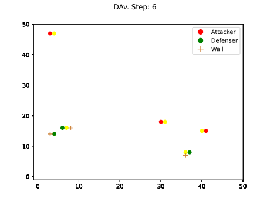
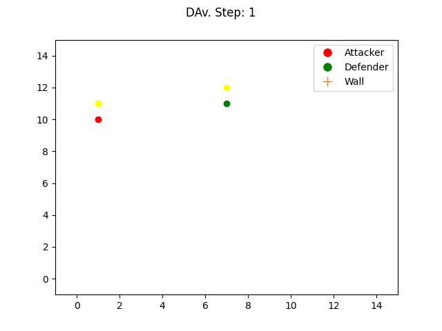
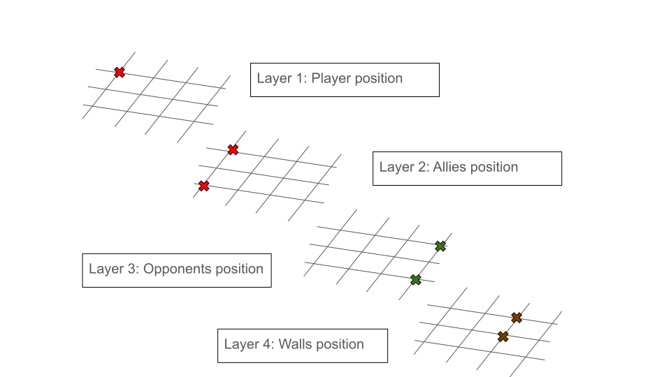
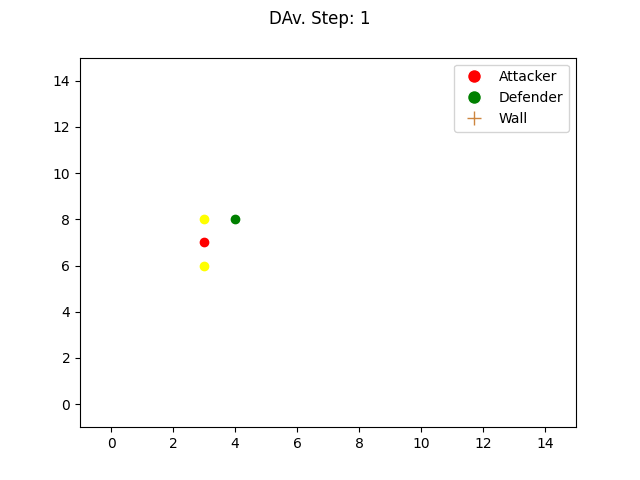

# DAv
## Overview
This repository provides an implementation of Defenders Attackers versus (DAv) environment, a simple and complex multi-agent RL environment.

<p align="center">
  
  
</p>

## Environment
DAv is a Reinforcement Learning environment where two sides confront each other. On one hand, the attackers aim to eliminate the defenders. To do so, they rush towards the defenders and touch them for elimination. At each iteration, they receive a negative reward of $\frac{-1}{\text{nb\_iteration}}$ and a positive reward of $+1$ each time they eliminate a defender. On the other hand, the defenders must evade the attackers. To assist in this task, they can drop walls, at the cost of one step iteration, in their path to slow down the attackers chasing them. At each iteration, they receive a positive reward of $\frac{+1}{\text{nb\_iteration}}$. When they are killed, depending on your implementation, they can enter an absorbing state with a negative reward of $-1$, as implemented in `./Codes/Mains/main_DAv.py`.
The environment is implemented in such a way that at each iteration, all actions must be provided to the environment, with the attackers playing first.
## How to run the project
### Setup your working environment
1. Create and activate a virtual environment (optional)
```bash
python3 -m venv dav_venv
source dav_venv/bin/activate
```
2. Setup the project and download the requirements
```bash
pip3 install -e .
pip3 install -r requirements.txt
```

### Use the environment
To use the environment with your own policy, you can use the code template provided in the file `./Codes/Mains/main_DAv.py`:
```python
def main():
    env = gym.make("env_DAv-v0", rendering=True)
    env.reset()
    env.render()
    while not env.terminated:
        actions = ....  # Put your actions vector here
        obs, rewards, terminated, truncated, info = env.step(actions)
        env.render()


if __name__ == "__main__":
    main()
```

### Examples
In the folder `./Codes/Mains/Examples` you will find two examples about how to use the environment.
#### Train a model
The first one, `DQN_Dav.py`, runs a training of the agents using my own implementation of [DQN](./Codes/rl_agents/agents/DQN/).
To run this script, run:
```bash
python3 Mains/Examples/DAV/DQN_DAv.py
```
This example uses a representation of the environment where the attackers, defenders, and walls are seen through a matrix. This matrix is full of zeros, except for the desired position. The code for this state reprensentation can be found in the file `./Codes/Mains/Examples/DAv/utils.py`. An illustration can be seen below.
<p align="center">
  
</p>
Regarding DQN using CNN, it can be observed that without sufficient training iterations, the defenders may learn some unexpected behaviors, such as going back and forth to counter the attackers, as shown below.
<p align="center">
  
</p>

#### Use a trained model
The second one, `DQN_DAv_rendering.py`, runs one iteration of the environment using a trained model for the agents in order to show the agents playing against each other. Trained models can be found in the folder `./Codes/NN_Policies`
To run this script, run:
```bash
python3 Mains/Examples/DAV/DQN_DAv_rendering.py
```

## Citing

If you use the project in your work, please consider citing it with:

```bibtex
@misc{DAv,
  author = {Meddahi, Lounès},
  title = {DAv, an environment for player confrontation},
  year = {2023},
  publisher = {GitHub},
  journal = {GitHub repository},
  howpublished = {\url{https://github.com/LounesMD/DAv}},
}
```